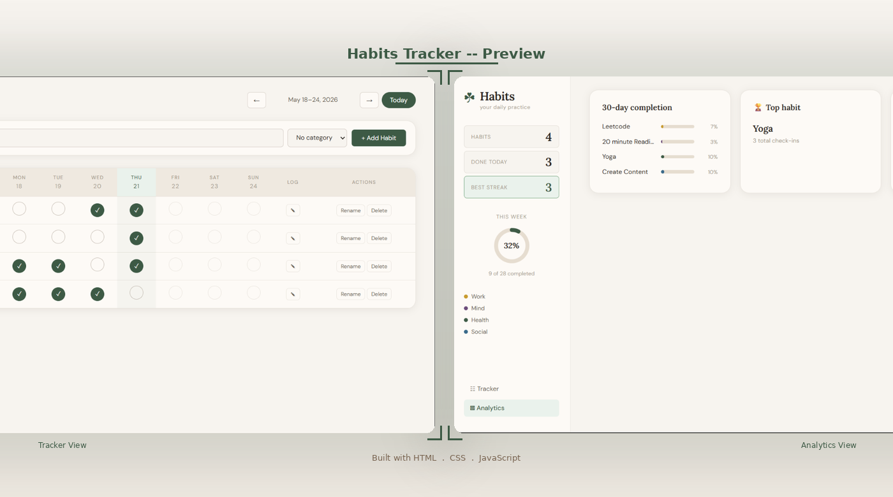

# Habits Tracker

A minimal, paper-toned daily habit tracker built with pure **HTML**, **CSS**, and **JavaScript**. Track habits across a weekly grid, log mood and notes for each entry, view streaks, and analyze your 30-day completion rate.

---

## Preview



---

## Features

- Weekly habit grid with day-by-day checkboxes
- Streak tracking with fire emoji display
- Best streak highlighted in the sidebar stats
- Weekly completion ring chart (SVG)
- Category color coding (Health, Mind, Body, Social, Creative, Work)
- Mood logging per habit per day (5 emoji moods)
- Notes per entry with 280 character limit
- Analytics view with 30-day completion bars, top habit, and longest streak
- Week navigation (prev, next, today)
- Rename and delete habits
- All data saved to localStorage so nothing is lost on refresh
- Toast notifications for actions
- Keyboard accessible (Enter, Space, Escape)
- Responsive layout, sidebar hides on small screens

---

## Project Structure

```
HabitsTracker/
├── index.html     # Markup, sidebar, tracker table, modal, analytics
├── style.css      # Paper-toned design system with CSS variables
├── script.js      # All logic, localStorage, rendering, analytics
└── preview.png    # Screenshot for README
```

---

## Getting Started

1. Clone the repo
   ```bash
   git clone https://github.com/your-username/habits-tracker.git
   cd habits-tracker
   ```

2. Open in browser
   ```bash
   open index.html
   ```

No setup, no dependencies, no build step needed.

---

## How It Works

Each habit is stored as an object with a `completed` dictionary mapping date strings to `true`:

```js
{
  id: 1716000000000,
  name: "Yoga",
  category: "health",
  createdAt: 1716000000000,
  completed: {
    "2026-05-18": true,
    "2026-05-19": true
  }
}
```

Streaks are calculated by walking backward from today and counting consecutive completed days. The entire state is serialized and saved to `localStorage` on every change.

---

## Customization

### Add a new category
In `script.js`, add an entry to `CAT_COLORS` and `CAT_LABELS`:
```js
const CAT_COLORS = {
  fitness: "#2e7d32",
  // ... existing categories
};
const CAT_LABELS = {
  fitness: "Fitness",
};
```

Then add the option to the select in `index.html`:
```html
<option value="fitness">Fitness</option>
```

### Change the accent color (moss green)
In `style.css`, update the `--moss` variable:
```css
:root {
  --moss: #3d5a45;       /* main green */
  --moss-light: #eaf2ec; /* light green background */
  --moss-mid: #7aa882;   /* mid green for ring */
}
```

### Change paper background
```css
:root {
  --paper: #f7f4ef;
  --card:  #fdfaf6;
}
```

---

## Views

| View | What it shows |
|------|---------------|
| Tracker | Weekly grid with checkboxes, streaks, log and action buttons |
| Analytics | 30-day completion bars, top habit card, longest streak card |

---

## Keyboard Shortcuts

| Key | Action |
|-----|--------|
| `Enter` / `Space` | Toggle focused habit checkbox |
| `Escape` | Close the log modal |

---

## Color Palette

| Token | Value | Used for |
|-------|-------|----------|
| `--paper` | `#f7f4ef` | Page background |
| `--card` | `#fdfaf6` | Card and sidebar background |
| `--moss` | `#3d5a45` | Primary green accent |
| `--clay` | `#b55e34` | Streak numbers |
| `--gold` | `#c89a2e` | Note dot indicator |
| `--ink` | `#2a2520` | Primary text |

---

## Author

**Kaneeza Batool**
CS Undergraduate, Sukkur, Pakistan
Built with HTML, CSS and JS
